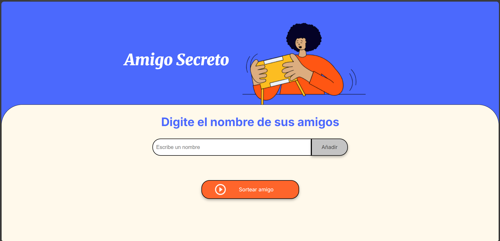
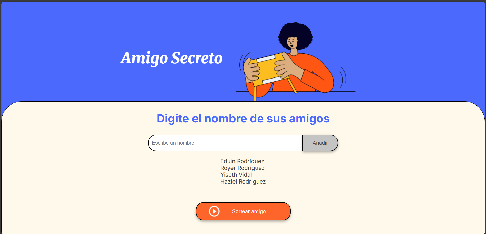
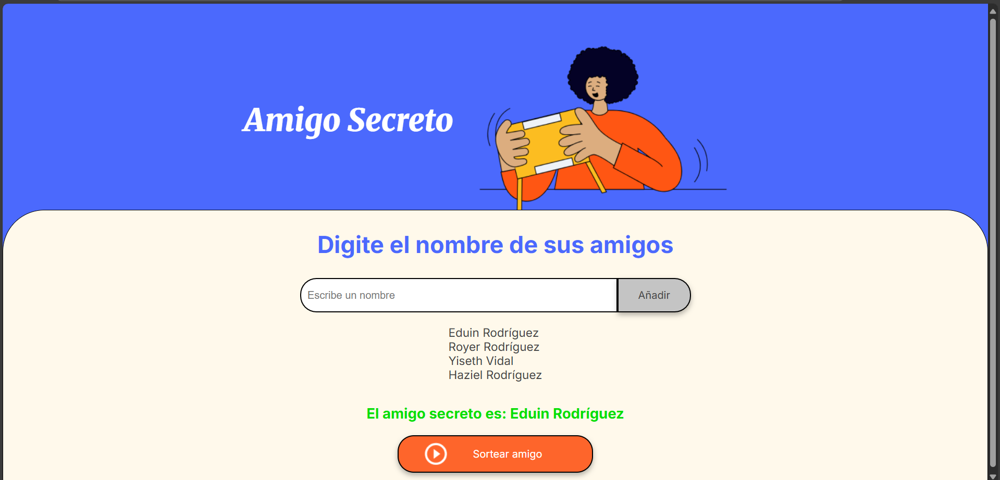
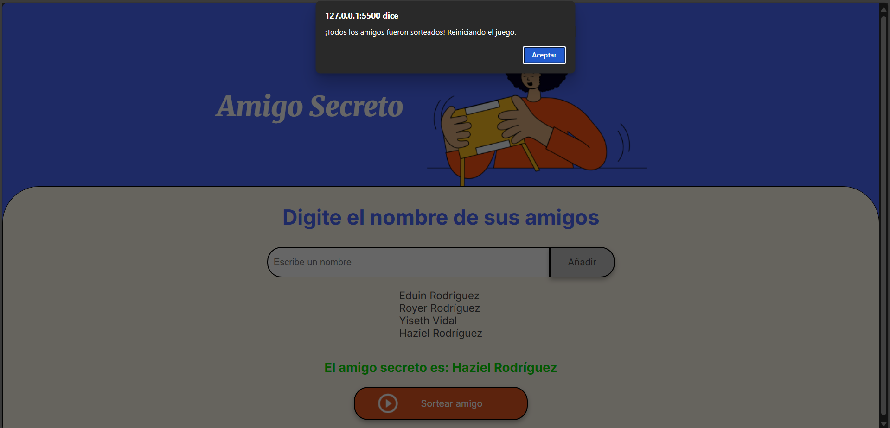

# ✨🎁 Amigo Secreto – Web App ✨

> **Un divertido sorteo de amigos, 100 % en tu navegador**  
> Hecho con pasion en **HTML, CSS y JavaScript** para que lo disfruten.

---

## 🌟 Características

✅ **Agregar amigos con validación estricta**  
   - Solo letras (con acentos).  
   - Permite un apellido, separado por un solo espacio.  
   - Cada palabra debe iniciar con **mayúscula**.  
   - Rechaza números, símbolos y duplicados.

✅ **Lista dinámica y clara**  
   - Cada amigo añadido aparece en una lista en tiempo real.

✅ **Sorteo aleatorio inteligente**  
   - Elige un amigo sin repetir.  
   - Cuando todos fueron sorteados, muestra un mensaje y **reinicia el juego**.

✅ **Alertas de error descriptivas**  
   - Explica exactamente el problema:  
     > “No se permiten números ni símbolos”  
     > “Cada palabra debe iniciar con mayúscula”  

---

## 🖼️ Capturas de Pantalla

| Pantalla | Descripción |
|----------|------------|
|  | **Inicio** – Vista principal antes de añadir nombres |
|    | **Lista** – Varios amigos agregados |
|  | **Resultado** – Amigo sorteado |
|  | **Reinicio** – Todos los amigos sorteados, juego reiniciado |

